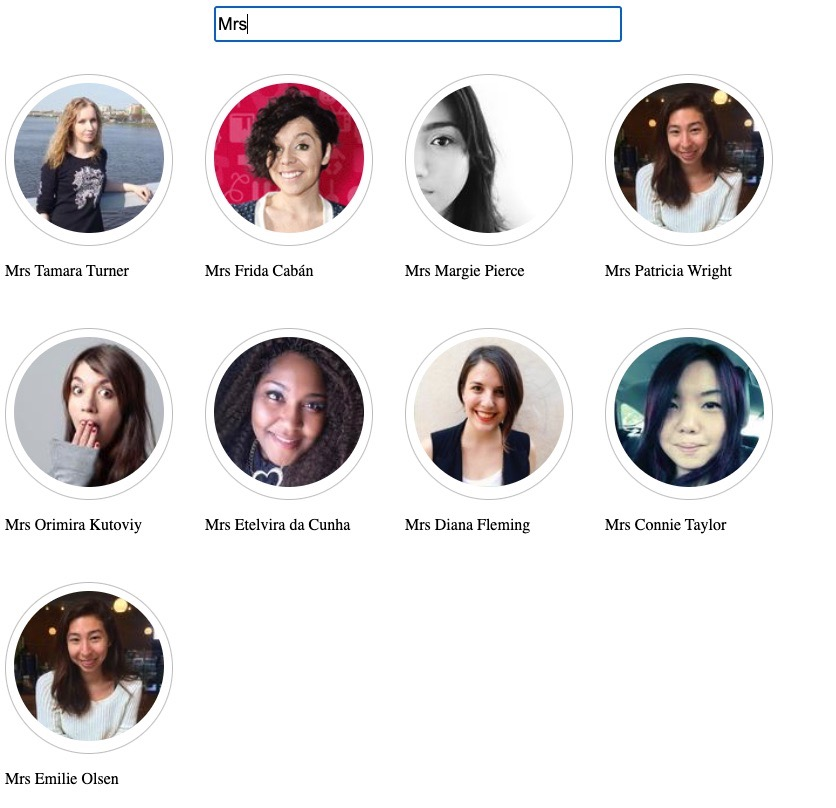

# User Filter App

This is a simple React application that fetches a list of users from the [randomuser.me](https://randomuser.me/) API and allows the user to filter the results by name using a search input.

## Installation

To run this app on your local machine, follow these steps:

1. Clone the repository to your machine using `git clone`.
2. Install the necessary dependencies by running `npm install`.
3. Start the development server by running `npm start`.
4. Open your browser and navigate to `http://localhost:3000` to view the app.

## Usage

Once the app is running, you will see a search input at the top of the screen. Type in a name to filter the list of users by name. The app will update the list of users as you type.

If there are no users found with the current search criteria, the app will display a message saying "No users found with this criteria."

## Code Overview

The app is made up of the following components:

-   `App`: The main component that fetches the users data and renders the `Filter` and `UserList` components.
-   `Filter`: A component that renders a search input and filters the users data based on the search text using debouncing to reduce component re-renderings.
-   `UserList`: A component that renders a list of `User` components.
-   `User`: A component that renders an individual user card.

The `fetchData` module is used to make a GET request to the `randomuser.me` API and return the user data.
